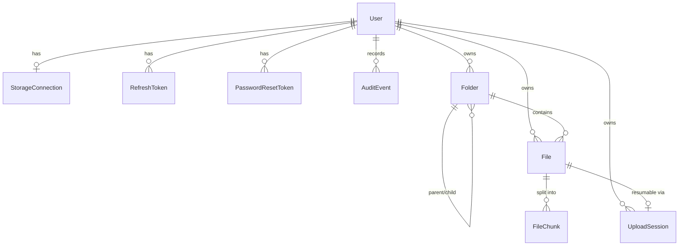

<!--
  ⚠️ LIVING DOCUMENT — must never go stale.
  Regenerate/update whenever apps/api/prisma/schema.prisma OR any API route
  changes. See "Maintaining this document" at the bottom, or run the
  `db-architecture-doc` skill (.claude/skills/db-architecture-doc).
  Last verified against schema + routes: 2026-07 (Phase 5 + zip + batched folder delete).
-->

# Pocketverse — Database & Backend Architecture

The single reference for the backend data model and how the HTTP API maps onto
it. Read the [ER overview](#entity-relationship-overview) first, then the
[per-table reference](#table-reference) (each table lists the exact endpoints
that touch it), then the [end-to-end flows](#end-to-end-flows) to see how tables
are used together.

- **Schema source of truth:** `apps/api/prisma/schema.prisma`
- **Route wiring:** `apps/api/src/app.ts`
- **Database:** PostgreSQL (Neon in prod) via Prisma
- **Migrations:** `apps/api/prisma/migrations/`

## Conventions

- **IDs** are `cuid()` strings unless noted.
- **Ownership:** almost every row hangs off a `User`. Every foreign key to
  `User` is `onDelete: Cascade`, so deleting a user erases their whole graph.
- **File bytes are never stored in this database.** Only metadata (names,
  sizes, folder tree, chunk pointers) lives here; the bytes live in the user's
  own Telegram channel. Chunks reference Telegram messages by id.
- **Secrets at rest are envelope-encrypted** (AES-256-GCM): a per-connection
  data key wrapped by the master keyring, AAD-bound to the user. Raw tokens are
  stored only as SHA-256 hashes.
- **Every mutating action is audited** into `AuditEvent`, which powers the
  user-facing activity log.
- **`limiters.*`** in `app.ts`: `auth` (tight, /api/auth), `connection` (tight
  OTP budget, only on connection start/verify), `uploads` (generous, the whole
  authenticated storage surface), `general` (tight, unauthenticated/abuse).

## Entity-relationship overview

---

## Table reference

### User

The account. Root of every ownership chain.

| Column                    | Type          | Notes                            |
| ------------------------- | ------------- | -------------------------------- |
| `id`                      | String (cuid) | PK                               |
| `email`                   | String        | `@unique`, normalized lower-case |
| `passwordHash`            | String        | argon2id                         |
| `createdAt` / `updatedAt` | DateTime      |                                  |

**Relations:** `connection` (0..1), `refreshTokens`, `resetTokens`,
`auditEvents`, `folders`, `files`, `uploadSessions` — all cascade on delete.

**APIs that touch this table**

| Endpoint                         | Service                             | Access                   |
| -------------------------------- | ----------------------------------- | ------------------------ |
| `POST /api/auth/register`        | `auth.service.register`             | creates User             |
| `POST /api/auth/login`           | `auth.service.login`                | reads + verifies         |
| `GET /api/auth/me`               | `auth.service.getUser`              | reads                    |
| `POST /api/auth/change-password` | `auth.service.changePassword`       | updates `passwordHash`   |
| `POST /api/auth/forgot-password` | `auth.service.requestPasswordReset` | reads (silent if absent) |
| `POST /api/auth/reset-password`  | `auth.service.resetPassword`        | updates `passwordHash`   |

---

### RefreshToken

Rotating refresh-token family for a session. Only the **hash** is stored.

| Column      | Type          | Notes                                  |
| ----------- | ------------- | -------------------------------------- |
| `id`        | String (cuid) | PK                                     |
| `tokenHash` | String        | `@unique`, SHA-256 of the cookie token |
| `userId`    | String        | FK → User (cascade)                    |
| `expiresAt` | DateTime      | 30-day lifetime                        |
| `revokedAt` | DateTime?     | set on rotate/logout/reuse-detection   |
| `createdAt` | DateTime      |                                        |

Index: `@@index([userId])`.

**APIs that touch this table**

| Endpoint                                          | Service                       | Access                                                     |
| ------------------------------------------------- | ----------------------------- | ---------------------------------------------------------- |
| `POST /api/auth/register`, `POST /api/auth/login` | `issueTokens`                 | creates                                                    |
| `POST /api/auth/refresh`                          | `auth.service.refresh`        | rotates; reuse of a revoked token revokes the whole family |
| `POST /api/auth/logout`                           | `auth.service.logout`         | revokes current                                            |
| `POST /api/auth/change-password`                  | `auth.service.changePassword` | revokes **all other** sessions                             |
| `POST /api/auth/reset-password`                   | `auth.service.resetPassword`  | revokes **all** sessions                                   |

---

### PasswordResetToken

Single-use password-reset token. Only the hash is stored; the raw token lives
solely inside the emailed reset link.

| Column      | Type          | Notes                                |
| ----------- | ------------- | ------------------------------------ |
| `id`        | String (cuid) | PK                                   |
| `tokenHash` | String        | `@unique`, SHA-256                   |
| `userId`    | String        | FK → User (cascade)                  |
| `expiresAt` | DateTime      | 30-minute lifetime                   |
| `usedAt`    | DateTime?     | set on successful reset (single-use) |
| `createdAt` | DateTime      |                                      |

Index: `@@index([userId])`.

**APIs that touch this table**

| Endpoint                         | Service                             | Access                 |
| -------------------------------- | ----------------------------------- | ---------------------- |
| `POST /api/auth/forgot-password` | `auth.service.requestPasswordReset` | creates                |
| `POST /api/auth/reset-password`  | `auth.service.resetPassword`        | reads + marks `usedAt` |

---

### StorageConnection

The link to the user's Telegram account (1:1 with User). Holds the
envelope-encrypted session and the pending multi-step login blob.

| Column                            | Type                | Notes                                                        |
| --------------------------------- | ------------------- | ------------------------------------------------------------ |
| `id`                              | String (cuid)       | PK                                                           |
| `userId`                          | String              | FK → User, `@unique` (1:1)                                   |
| `status`                          | ConnectionStatus    | `PENDING_CODE` / `PENDING_PASSWORD` / `CONNECTED` / `ERROR`  |
| `phoneMasked`                     | String              | display-only, e.g. `+91••••••1234`                           |
| `encryptedPhone`                  | String?             | full number, envelope-encrypted; reveal-only                 |
| `wrappedDataKey`                  | String              | per-connection data key wrapped by master keyring            |
| `encryptedSession`                | String?             | Telegram session, encrypted with the data key                |
| `encryptedPending`                | String?             | encrypted `{tempSession, phoneCodeHash, phone}` during login |
| `pendingExpiresAt`                | DateTime?           | 10-min TTL for the pending blob                              |
| `channelId` / `channelAccessHash` | String?             | the private storage channel                                  |
| `lastCheckedAt` / `lastError`     | DateTime? / String? | health state                                                 |

**APIs that touch this table**

| Endpoint                                     | Service                             | Access                                  |
| -------------------------------------------- | ----------------------------------- | --------------------------------------- |
| `POST /api/connection/start`                 | `connection.service.start`          | upsert, sets pending + `encryptedPhone` |
| `POST /api/connection/verify-code`           | `connection.service.verifyCode`     | update; may finalize (create channel)   |
| `POST /api/connection/verify-password`       | `connection.service.verifyPassword` | finalize (2FA)                          |
| `GET /api/connection`                        | `connection.service.getStatus`      | reads (masked DTO)                      |
| `GET /api/connection/phone`                  | `connection.service.revealPhone`    | decrypts `encryptedPhone`               |
| `POST /api/connection/check`                 | `connection.service.check`          | health → `CONNECTED`/`ERROR`            |
| `DELETE /api/connection`                     | `connection.service.disconnect`     | deletes row (+ purges drive)            |
| _(worker)_ `chunk-upload`, `messages-delete` | `storage.worker`                    | reads session; flags `ERROR` on revoke  |
| _(cron)_ keep-alive sweep                    | `keepalive`                         | pings stale connections, updates health |

---

### Folder

The user's folder tree (self-referential).

| Column     | Type          | Notes                              |
| ---------- | ------------- | ---------------------------------- |
| `id`       | String (cuid) | PK                                 |
| `name`     | String        |                                    |
| `parentId` | String?       | FK → Folder (cascade); null = root |
| `ownerId`  | String        | FK → User (cascade)                |

Constraints: `@@unique([ownerId, parentId, name])` (no dup names in a folder),
`@@index([ownerId, parentId])`.

**APIs that touch this table**

| Endpoint                                | Service                               | Access                                           |
| --------------------------------------- | ------------------------------------- | ------------------------------------------------ |
| `POST /api/folders`                     | `folders.service.createFolder`        | creates                                          |
| `POST /api/folders/ensure-path`         | `folders.service.ensureFolderPath`    | get-or-create each segment; returns `createdIds` |
| `PATCH /api/folders/:id`                | `folders.service.updateFolder`        | rename/move (cycle-checked)                      |
| `DELETE /api/folders/:id`               | `folders.service.deleteFolder`        | recursive delete (+ audit tree)                  |
| `DELETE /api/folders/:id?onlyIfEmpty=1` | `folders.service.deleteFolderIfEmpty` | delete only if no files (cancel cleanup)         |
| `GET /api/drive`                        | `folders.service.listDrive`           | reads (listing + subtree size)                   |
| `GET /api/files/zip?token=`             | `files.service.prepareZip`            | reads subtrees to mirror structure in zip        |
| `GET /api/stats`                        | stats router                          | counts folders                                   |

---

### File

File metadata. Bytes are NOT here — see `FileChunk`.

| Column        | Type          | Notes                                         |
| ------------- | ------------- | --------------------------------------------- |
| `id`          | String (cuid) | PK                                            |
| `name`        | String        |                                               |
| `size`        | BigInt        | total bytes                                   |
| `mimeType`    | String        |                                               |
| `status`      | FileStatus    | `UPLOADING` / `READY` / `ERROR`               |
| `checksum`    | String?       | sha256, or `composite:<hash>` for multi-chunk |
| `totalChunks` | Int           |                                               |
| `folderId`    | String?       | FK → Folder (cascade); null = root            |
| `ownerId`     | String        | FK → User (cascade)                           |

Indexes: `@@index([ownerId, folderId])`, `@@index([ownerId, name])` (search).

**APIs that touch this table**

| Endpoint                             | Service                      | Access                                  |
| ------------------------------------ | ---------------------------- | --------------------------------------- |
| `POST /api/files/uploads`            | `files.service.createUpload` | creates File (+ chunks + session)       |
| `GET /api/files/:id`                 | `files.service.getFile`      | reads                                   |
| `GET /api/files/search?q=`           | `files.service.search`       | reads by name                           |
| `GET /api/files/:id/download`        | `files.service.download`     | reads; marks `ERROR` if a chunk is gone |
| `POST /api/files/zip-token`          | `files.service.prepareZip`   | reads (validates selection + size cap)  |
| `GET /api/files/zip?token=`          | `files.service.prepareZip`   | reads; streams the selection as one zip |
| `POST /api/files/:id/download-token` | `files.service.getFile`      | reads (ownership)                       |
| `PATCH /api/files/:id`               | `files.service.updateFile`   | rename/move                             |
| `DELETE /api/files/:id`              | `files.service.deleteFile`   | deletes (+ storage cleanup)             |
| `POST /api/files/retry-failed`       | `files.service.retryFailed`  | reads ERROR files; flips to `UPLOADING` |
| `GET /api/drive`, `GET /api/stats`   | listing / aggregate          | reads / counts                          |
| _(worker)_ `chunk-upload`            | `storage.worker`             | flips to `READY` (or `ERROR`)           |

---

### FileChunk

One row per ≤1.5 GB chunk of a file — the pointer to a Telegram message.

| Column              | Type          | Notes                                          |
| ------------------- | ------------- | ---------------------------------------------- |
| `id`                | String (cuid) | PK                                             |
| `fileId`            | String        | FK → File (cascade)                            |
| `index`             | Int           | chunk order                                    |
| `size`              | BigInt        |                                                |
| `checksum`          | String?       | per-chunk sha256                               |
| `telegramMessageId` | String?       | the stored message (null until uploaded)       |
| `status`            | ChunkStatus   | `PENDING` / `UPLOADING` / `UPLOADED` / `ERROR` |
| `attempts`          | Int           | retry counter                                  |
| `progress`          | Int           | 0–100, drives the UI sync %                    |

Constraint: `@@unique([fileId, index])`.

**APIs that touch this table**

| Endpoint                                  | Service                      | Access                                                               |
| ----------------------------------------- | ---------------------------- | -------------------------------------------------------------------- |
| `POST /api/files/uploads`                 | `files.service.createUpload` | creates chunk rows                                                   |
| `PUT /api/files/uploads/:id/parts/:index` | `files.service.uploadPart`   | records checksum; enqueues `chunk-upload`                            |
| `POST /api/files/retry-failed`            | `files.service.retryFailed`  | resets non-uploaded chunks to `PENDING`                              |
| `GET /api/drive`, `GET /api/files/:id`    | listing / getFile            | reads (status + progress)                                            |
| `GET /api/files/zip?token=`               | `files.service.prepareZip`   | reads ordered chunks per zip entry                                   |
| _(worker)_ `chunk-upload`                 | `storage.worker`             | UPLOADING → UPLOADED (+ `telegramMessageId`); orphan check on cancel |

---

### UploadSession

Resumable-upload cursor for an in-flight file (1:1 with File).

| Column                                  | Type          | Notes                |
| --------------------------------------- | ------------- | -------------------- |
| `id`                                    | String (cuid) | PK                   |
| `fileId`                                | String        | FK → File, `@unique` |
| `ownerId`                               | String        | FK → User (cascade)  |
| `partSize` / `chunkSize` / `totalParts` | Int           | protocol geometry    |
| `nextPart`                              | Int           | resume cursor        |
| `expiresAt`                             | DateTime      | 24-hour TTL          |

Index: `@@index([ownerId])`.

**APIs that touch this table**

| Endpoint                                  | Service                      | Access                   |
| ----------------------------------------- | ---------------------------- | ------------------------ |
| `POST /api/files/uploads`                 | `files.service.createUpload` | creates                  |
| `GET /api/files/uploads/:id`              | `files.service.getUpload`    | reads resume cursor      |
| `PUT /api/files/uploads/:id/parts/:index` | `files.service.uploadPart`   | advances `nextPart`      |
| `DELETE /api/files/uploads/:id`           | `files.service.abortUpload`  | removed via File cascade |

---

### AuditEvent

Append-only trail; source for the activity log. `type` is a dotted string
(e.g. `file.uploaded`); `metadata` is free-form JSON (never secrets).

| Column      | Type          | Notes                                       |
| ----------- | ------------- | ------------------------------------------- |
| `id`        | String (cuid) | PK                                          |
| `userId`    | String        | FK → User (cascade)                         |
| `type`      | String        | see `AuditEventTypes` in `audit.service.ts` |
| `metadata`  | Json?         | e.g. `{ name, size, tree }`                 |
| `createdAt` | DateTime      |                                             |

Index: `@@index([userId, createdAt])`.

**APIs that touch this table** — written by nearly every mutation; read by one:

| Endpoint                                                         | Access                                 |
| ---------------------------------------------------------------- | -------------------------------------- |
| `GET /api/activity?cursor=`                                      | reads (cursor-paginated, newest first) |
| _(all mutating auth/connection/file/folder endpoints + workers)_ | write via `audit.record(...)`          |

Event types: `auth.register/login/password_changed/password_reset_requested/password_reset`,
`connection.started/connected/disconnected/health_failed/session_revoked`,
`file.uploaded/upload_failed/deleted/unreachable`, `folder.deleted`,
`drive.index_cleared`.

---

## End-to-end flows

How the tables are used **together**. Each step notes the table(s) it hits.

### 1. Sign up / sign in

`POST /api/auth/register` → create **User** → create **RefreshToken** → audit
`auth.register`. Login is the same minus User creation. Refresh rotates the
**RefreshToken** row (reuse ⇒ revoke family).

### 2. Connect Telegram (multi-step, restart-safe)

1. `POST /api/connection/start` → upsert **StorageConnection** (`PENDING_CODE`,
   `encryptedPending`, `encryptedPhone`) → audit `connection.started`.
2. `POST /api/connection/verify-code` → update **StorageConnection**; if 2FA
   needed → `PENDING_PASSWORD`, else finalize.
3. Finalize (`verify-code` or `verify-password`) → create Telegram channel →
   store `encryptedSession` + channel ids, `CONNECTED` → audit
   `connection.connected`.

### 3. Upload a file (HTTP → disk → background sync)

1. `POST /api/files/uploads` → create **File** (`UPLOADING`) + **FileChunk**
   rows (`PENDING`) + **UploadSession**.
2. `PUT /uploads/:id/parts/:index` (repeated) → append bytes to disk staging,
   advance **UploadSession.nextPart**; when a chunk's parts are complete →
   record **FileChunk.checksum** → enqueue `chunk-upload`.
3. _(worker)_ `chunk-upload` → stream staged bytes to the channel → set
   **FileChunk** `UPLOADED` + `telegramMessageId`. When all chunks are up →
   **File** `READY` → audit `file.uploaded`. (If the File was deleted
   mid-flight, the just-posted message is removed as an orphan.)

### 4. Download

Zip: `POST /api/files/zip-token` validates a selection (files + folder
subtrees, ownership + size cap) and mints a short-lived token;
`GET /api/files/zip?token=` re-resolves it and streams every entry over ONE
storage connection as a store-mode zip. Single file:
`GET /api/files/:id/download` (bearer or short-lived token) → read **File** +
ordered **FileChunk** rows → stream each chunk's message from the channel. A
missing message → **File** `ERROR` + audit `file.unreachable`; a revoked
session → **StorageConnection** `ERROR` + audit `connection.session_revoked`.

### 5. Folder upload (client orchestration)

Client calls `POST /api/folders/ensure-path` per unique directory (get-or-create
each **Folder** segment, returns `createdIds`), then runs flow #3 per file into
the resolved folder id. Cancelling deletes the created files and then the
created folders via `DELETE /api/folders/:id?onlyIfEmpty=1`.

### 6. Delete

- `DELETE /api/files/:id` → delete **File** (cascades **FileChunk** +
  **UploadSession**) → enqueue `messages-delete` for the channel messages →
  audit `file.deleted`.
- `DELETE /api/folders/:id` → gather subtree (**Folder** + **File** +
  **FileChunk**) → delete **File** rows in bounded batches (each cascades its
  chunks + session; avoids one giant locking cascade) → delete the **Folder**
  rows → enqueue `messages-delete` → audit `folder.deleted` with a nested
  contents tree.

### 7. Disconnect

`DELETE /api/connection` → log out remotely → delete all **File** + **Folder**
rows, purge staging → delete **StorageConnection** → audit `drive.index_cleared`,
one `file.upload_failed` per unfinished file, and `connection.disconnected`.

### 8. Session revoked from inside Telegram

Any worker/download hitting `AUTH_KEY_UNREGISTERED`/`SESSION_REVOKED` → mark
**StorageConnection** `ERROR` + audit `connection.session_revoked`. The drive
shows a reconnect banner; the keep-alive cron catches idle cases.

---

## Maintaining this document

**This file must never contain stale data.** Update it in the **same change**
that alters either side it documents:

- **Schema change** (`apps/api/prisma/schema.prisma` / a new migration): update
  the affected [table section](#table-reference), the [ER diagram](#entity-relationship-overview),
  and any [flow](#end-to-end-flows) that now touches the table differently.
- **API change** (any `apps/api/src/modules/**/*.routes.ts`, or route mounting
  in `apps/api/src/app.ts`): update the **"APIs that touch this table"** table
  for every table the endpoint reads or writes, and add/adjust a flow if it's a
  new multi-table operation.

The `db-architecture-doc` skill (`.claude/skills/db-architecture-doc/SKILL.md`)
packages this procedure. A `pnpm docs:check-db` guard (run in pre-commit) warns
when schema/routes were changed without touching this file.
